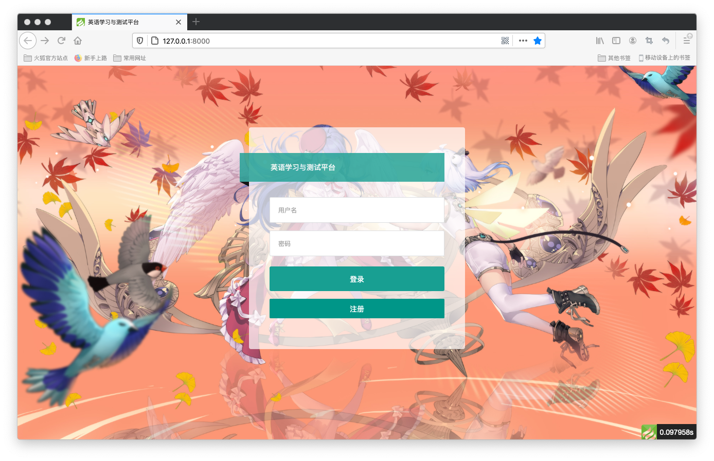
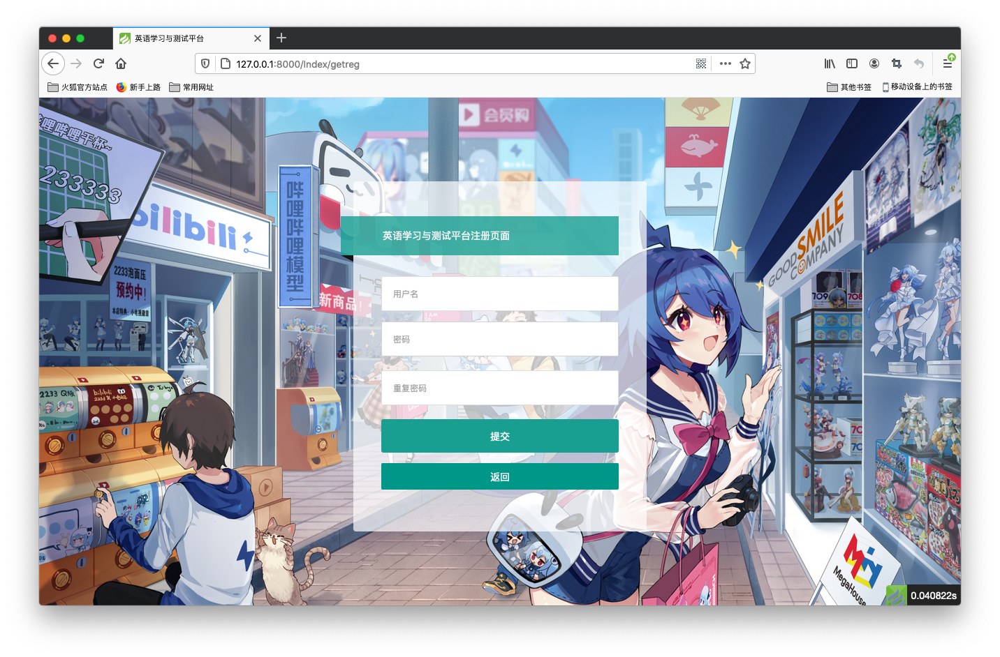
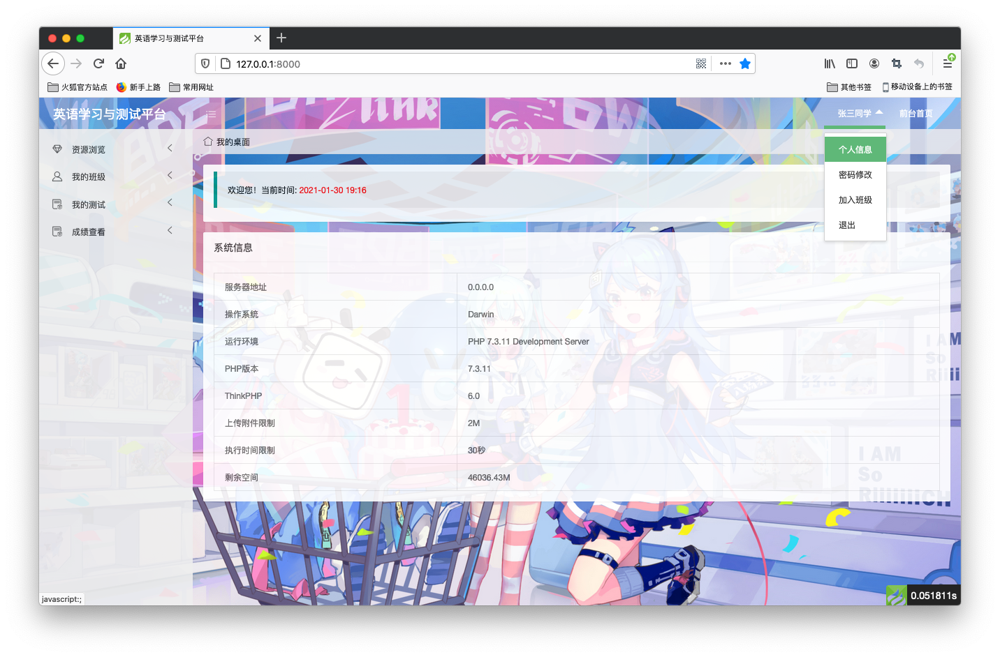
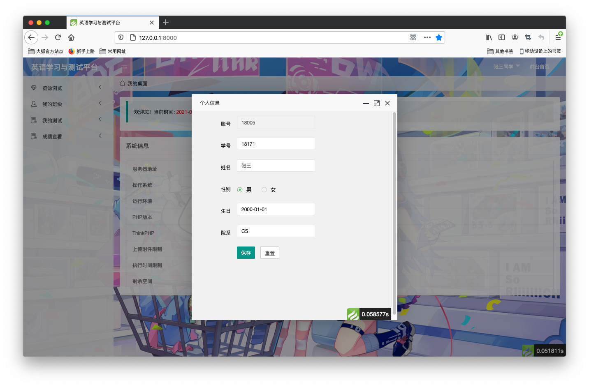
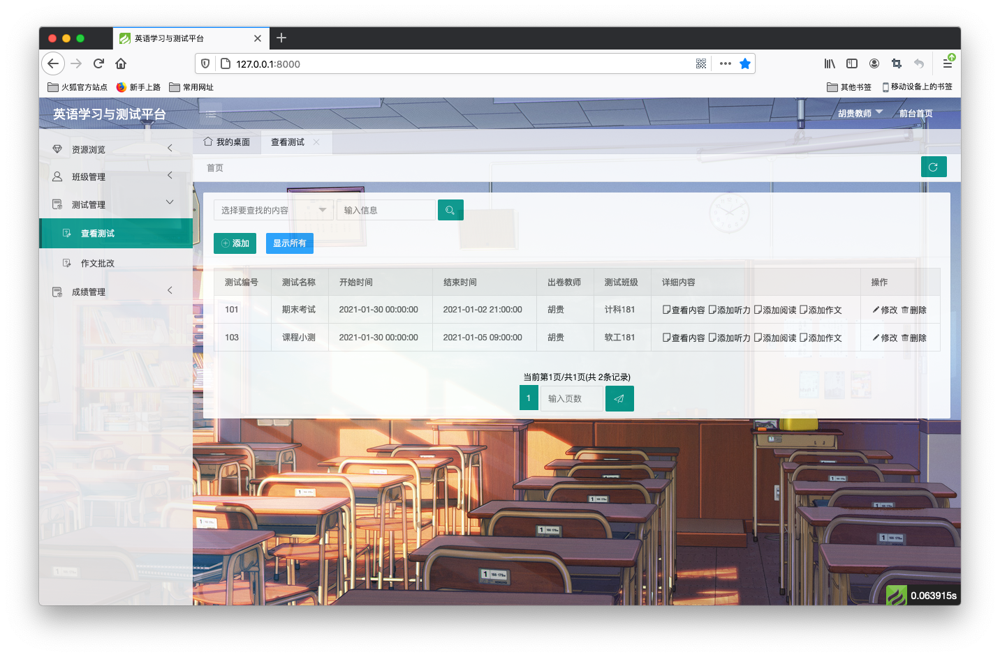
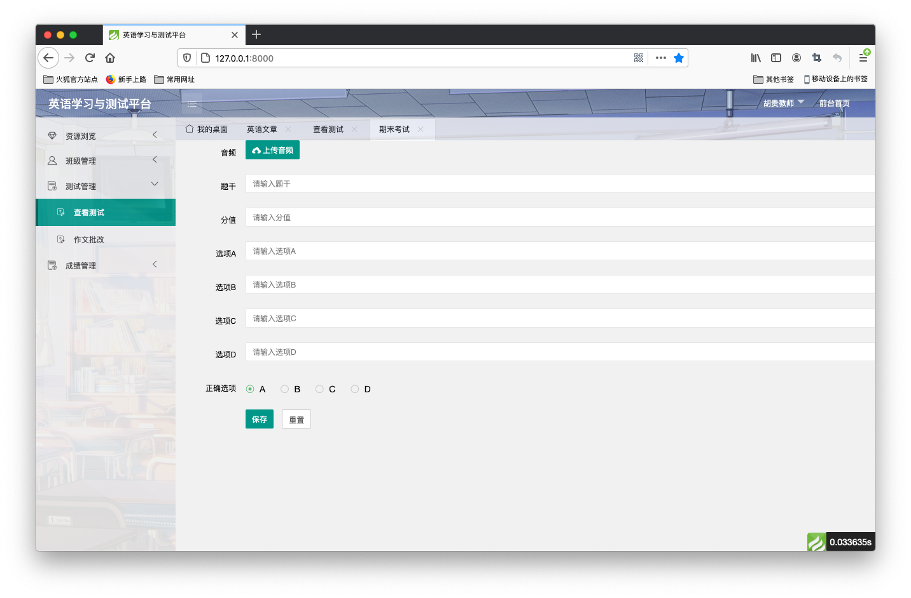
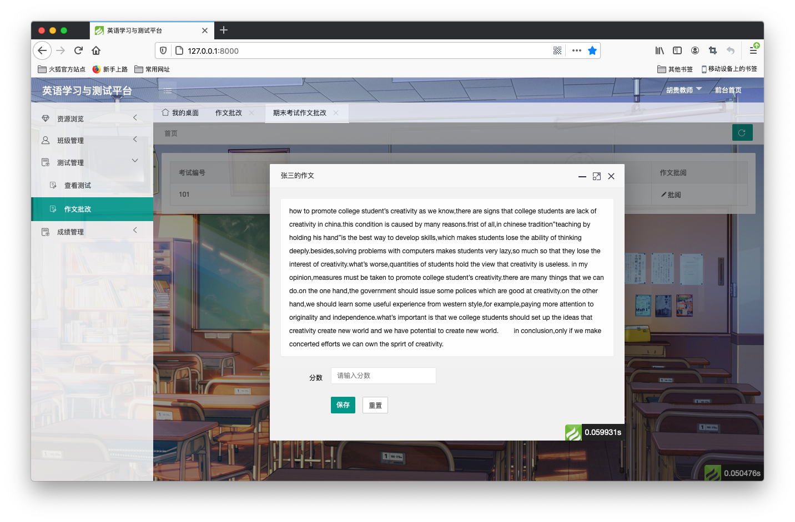
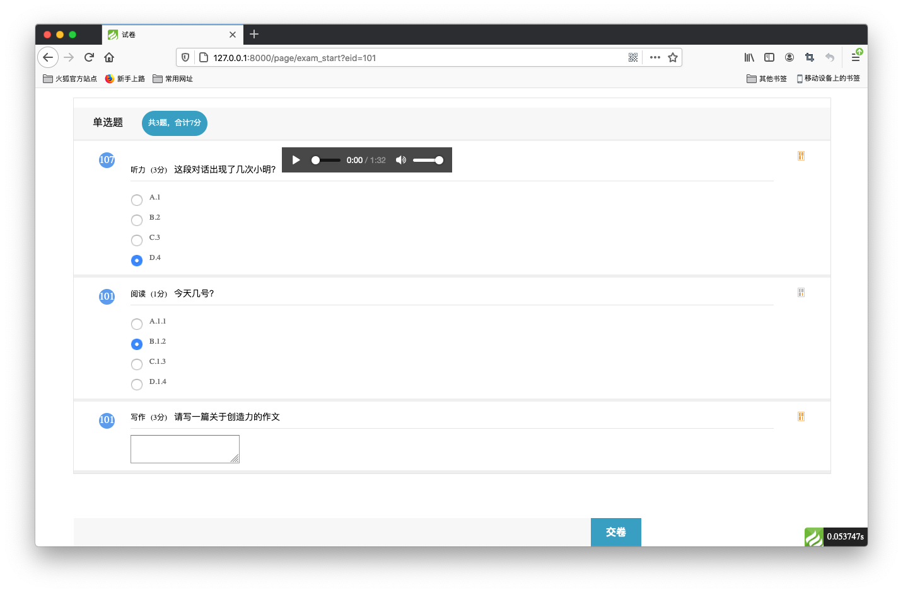
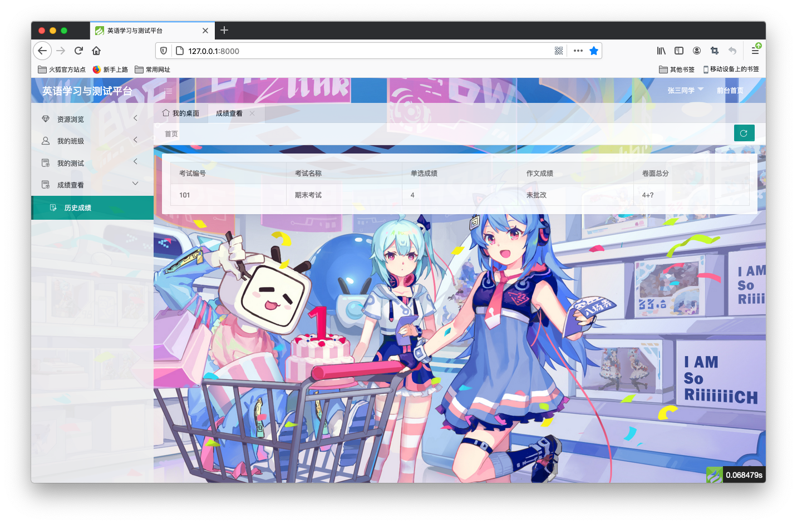
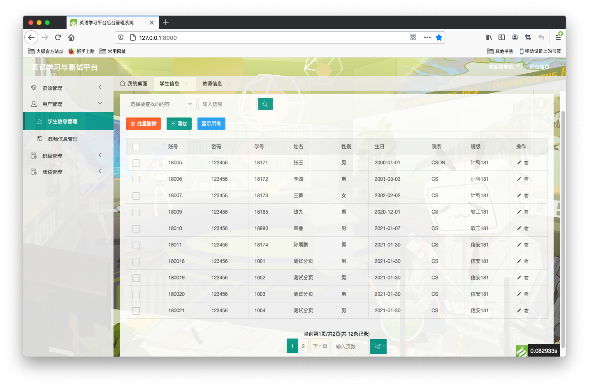

数据库课设：英语学习与测试平台
===============

> 运行环境要求PHP7.1+

>基于thinkPHP6.0、Layui、Xadmin开发

## 主要功能

- 公共模块
  - 登录注册
  - 个人信息修改
  - 密码修改
- 教师模块
  - 文章查看发布
  - 班级管理
  - 测试查看发布批改
  - 历史成绩查看
- 学生模块
  - 文章查看
  - 参与测试
  - 查看成绩
- 管理员模块
  - 学生信息管理
  - 教师信息管理（未完善）
  - 文章管理（未完善）
  - 测试管理（未完善）
  - 成绩管理（未完善）

其实就是些表单提交，然后增删查改数据库

## 展示

>登录注册界面
> 

> 个人信息密码修改
>

>测试查看发布批改

>参加测试查看成绩

>管理员

## 使用

本项目基于thinkPHP开发，只需要提供PHP7.x的运行环境即可。数据库文件放在项目的根目录下，需要的可以自己导入。

- 管理员账号18001密码root

- 教师账号账号18003和18004密码123456

- 学生账号18005密码123456

  

## 开发说明

>喝水不忘挖井人https://github.com/xiaoyou66/DatabaseKeshe

在此基础上修改了一些代码，使之更为合理。新增文件上传功能、对TP6自带分页进行了探索（参见：管理员模块->教师信息管理）
>涉及：HTML、CSS、JS（JQuery、Layui、Xadmin）、thinkPHP

>开发之中遇见困难参考我的博文：https://blog.csdn.net/weixin_43538042?spm=1010.2135.3001.5343

## 版权信息

本源码遵循Apache2开源协议发布，并提供免费使用。

本项目包含的第三方源码和二进制文件之版权信息另行标注。

版权所有Copyright © 2006-2019 by xiaoyou (https://xiaoyou66.com)

All rights reserved。

更多细节参阅 [LICENSE.txt](LICENSE.txt)
