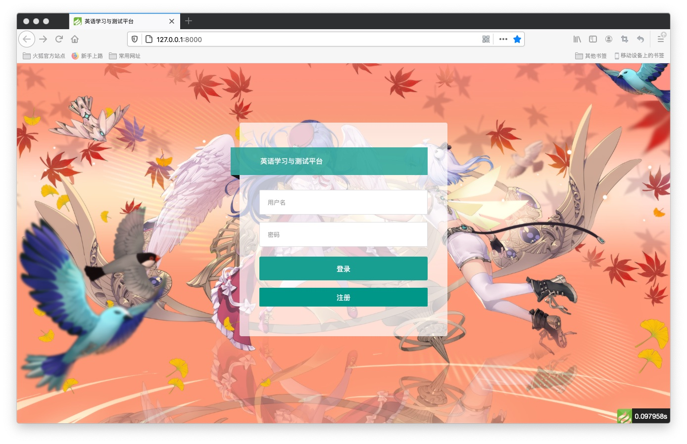
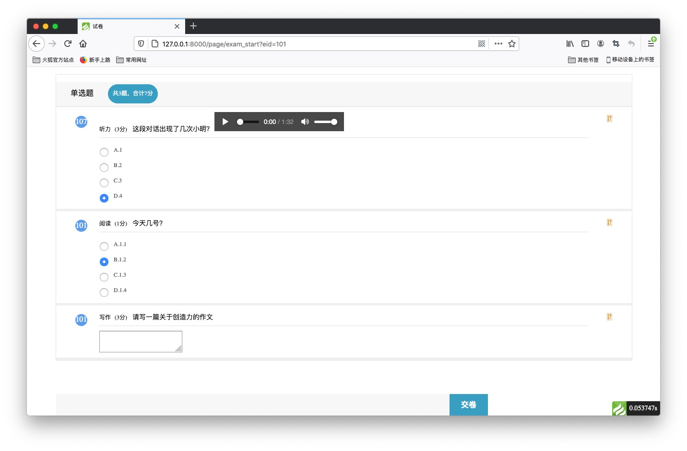
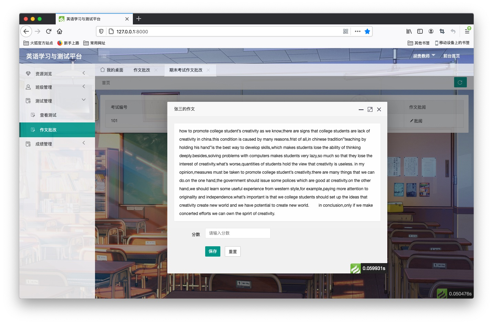
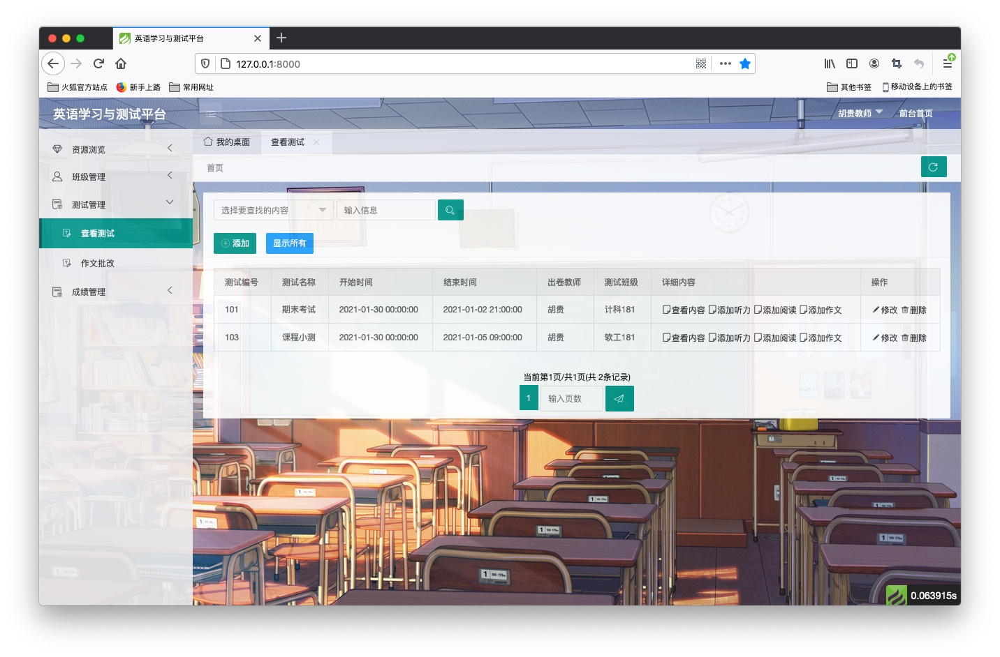
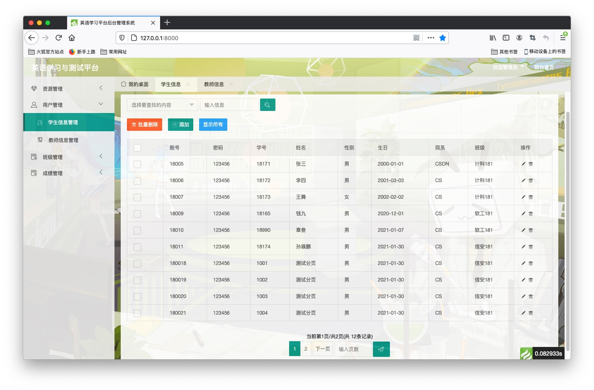

英语学习与测试平台
===============

## 主要功能

（1）公共模块

登录注册、个人信息修改、密码修改

（2）教师模块

文章查看发布、班级管理、测试查看发布批改、历史成绩查看

（3）学生模块

文章查看、参与测试、查看成绩

（4）信息管理模块

学生信息管理、教师信息管理（待完善）、文章管理（待完善）、考试管理（待完善）、成绩管理（待完善）

## 展示

## 开发环境

运行环境：PHP7.1+

框架：thinkPHP6.0

前端：HTML、CSS、JS（JQuery、Layui、Xadmin）

数据库：`learnEnglish_2021-01-30.sql`

> 管理员账号18001密码root
>
> 教师账号账号18003和18004密码123456
>
> 学生账号18005密码123456

## 开发说明

>前端页面借鉴于 https://github.com/xiaoyou66/DatabaseKeshe

新增文件上传功能、对TP6自带分页进行了探索（参见：管理员模块->教师信息管理）

前后端不分离，现在来看真是糟糕的设计。

